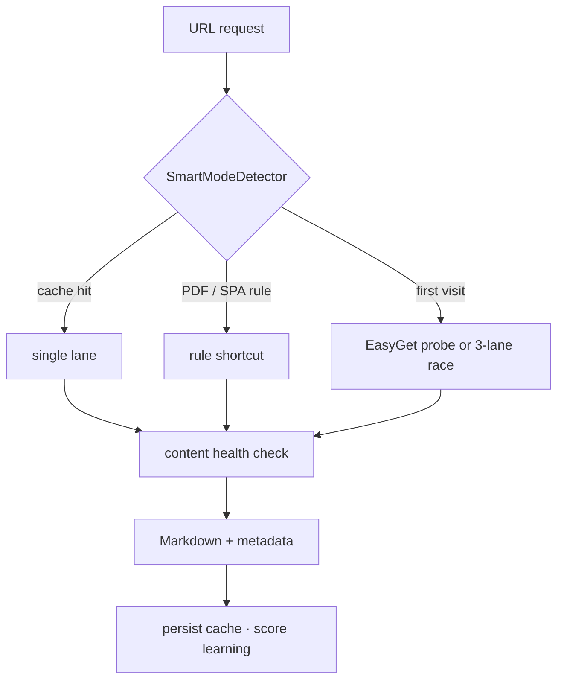
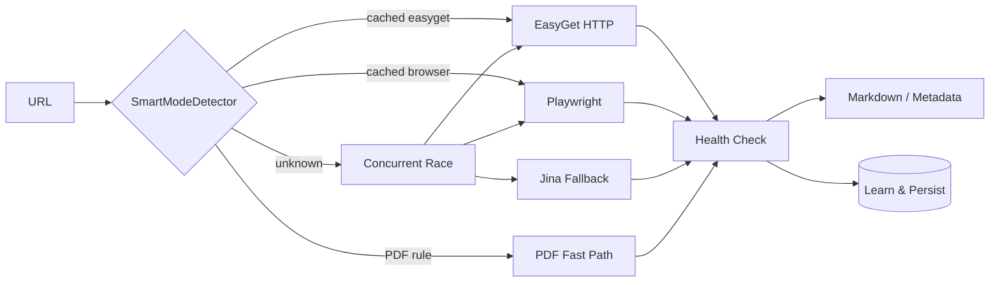

<div align="center">


# OmniFetcher

### AI Agent Network Base

**Adaptive URL fetch engine for agents & RAG — learns the best route per domain (HTTP · Browser · PDF).**

<br />

[](https://www.python.org/)
[](LICENSE)
[](https://fastapi.tiangolo.com/)
[](https://playwright.dev/)
[](https://github.com/lijiandao/omnifetcher/pulls)

[English](README.md) · [中文](README.zh-CN.md)

<br />

[Highlights](#-highlights) · [Benchmarks](#-benchmarks) · [Quick Start](#-quick-start) · [Architecture](#-architecture) · [API](#-api-reference) · [Configuration](#-configuration--network)

</div>

---

## ✨ Highlights

OmniFetcher is not "another curl + Readability wrapper". It closes the loop across **routing, execution, quality checks, networking, and learning**: the first fetch to a new domain may be slow, but the system remembers which lane works — and only returns **health-checked** content to your agent.



---

### 🧠 1. Self-learning router (SmartModeDetector)

**Problem**: Juejin works fine over HTTP (435 ms); Zhihu needs a browser; arXiv PDFs need a dedicated pipeline. Static rule tables cannot keep up.

**Approach**: cold-start rules → live probe → persistent learning.

<details open>
<summary><b>Decision priority (high → low)</b></summary>

| Step | Condition | Lane |
|:--|:--|:--|
| 1 | `domain_cache` hit | cached `easyget` / `playwright` / `jina` / `pdf` |
| 2 | PDF URL pattern match | PDF fast path |
| 3 | SPA domain blacklist | Playwright |
| 4 | otherwise | real EasyGet probe (10 s timeout) |
| 5 | still uncertain | **EasyGet ∥ Playwright ∥ Jina** concurrent race |

Cache supports **parent-domain fallback**: `foo.bar.example.com` → `bar.example.com` → `example.com`.

</details>

<details>
<summary><b>Domain score (not a simple boolean)</b></summary>

Each domain stores `decision` + `score` in `config/smart_detector_config.json`:

- fetch **success** → **+1** for the winning lane
- fetch **failure** → **-1**
- lane switch → score **reset to 1**
- score **≤ 0** → entry **removed**

After concurrent races, `learn_from_result()` compares predicted vs actual lane so the cache converges over time.

</details>

<details>
<summary><b>Automatic PDF pattern discovery</b></summary>

After **3** successful PDF fetches on a domain (configurable):

1. domain added to `known_pdf_domains`
2. path segments containing `pdf` saved to `pdf_path_patterns`
3. persisted to disk — survives restarts

</details>

<details>
<summary><b>SPA HTML fingerprint (cold-start safety net)</b></summary>

| Signal | Weight |
|:--|--:|
| empty body text | 40 |
| ≥ 10 `<script>` tags | 35 |
| React / Vue / Angular fingerprints | 30 |
| `#root` / `app-root` containers | 25 |
| SPA-related meta tags | 10 |

≥ **2** matches → Playwright directly.

</details>

---

### ⚡ 2. Multi-lane race (EasyGet ∥ Playwright ∥ Jina)

**Problem**: when routing guesses wrong, a single lane wastes user time.

**Approach**: three lanes start together; **first health-checked winner** returns; losers are **gracefully cancelled** (CDP `Page.stopLoading` → `page.close()` → cancel tasks).

| Lane | Strength | Typical use |
|:--|:--|:--|
| **EasyGet** | raw HTTP, `selectolax`, Edge cookies | static blogs, direct PDFs |
| **Playwright** | real browser, JS rendering | Zhihu, Cloudflare, cookie-gated sites |
| **Jina** | third-party Reader (`r.jina.ai`) | hard-site fallback (optional) |

<details>
<summary><b>Not "first response wins"</b></summary>

EasyGet / Jina must pass `evaluate_content_health()` before declaring victory:

- garbled / binary magic → keep waiting for Playwright
- Cloudflare / captcha short pages → not a win
- text < `text_limit` (default 150) → not a win

Only after `verified_http_success` is set will the browser lane be cancelled.

</details>

<details>
<summary><b><code>mode</code> parameter</b></summary>

| `mode` | Behavior |
|:--|:--|
| `normal` | **recommended** — smart cache first, then probe or race |
| `fast` | EasyGet only |
| `playwright` | browser only |
| `jina` | Jina only |
| `no_jina` | EasyGet ∥ Playwright |

With `use_intellicache: true` (default): **learn when possible, race when not**.

</details>

---

### 🛡️ 3. Content quality guards

**Problem**: the worst failure is `success=true` with captcha / empty SPA shell / mojibake — it poisons RAG and agent context.

<details open>
<summary><b>Three-layer funnel</b></summary>

**① Transport decoding (EasyGet)**

Encoding chain: `Content-Type charset` → HTML `<meta charset>` → `chardet` (>0.7) → `utf-8 / gbk / gb18030 / big5` fallbacks.

Garbled / binary detection:

- **magic bytes**: `%PDF-`, ZIP, JPEG, … → EasyGet fails over to Playwright / PDF
- **ftfy `is_mojibake`**
- **printable ratio < 90%** (text ≥ 50 chars)

**② Semantic health check (all lanes — `evaluate_content_health`)**

1. HTTP 401 / 403 / 429
2. block keywords (Cloudflare, captcha, rate limit, …) — **only on short pages < 500 chars**
3. empty text → `PAGE_NOT_LOADED`
4. text < `text_limit` → `PAGE_PARTIAL_LOAD`

**③ HTML → Markdown**

`selectolax` → optional Readability → `html2text`. Huge pages use map-reduce (below).

</details>

---

### 🌐 4. Agent-ready network layer

**Network Base** = proxy orchestration + egress strategy + large-page handling for production agent workloads.

<details>
<summary><b>Clash proxy rotation (before each fetch)</b></summary>

Each `POST /crawl` in normal mode **async** triggers `_rotate_proxy_for_request()` (non-blocking):

```
1. Clash External Controller API (default 127.0.0.1:19099), selector GLOBAL
2. batch latency test all nodes (gstatic generate_204)
3. select_with_weight:
   score = 0.7 × delay_norm + 0.3 × recency_norm
4. PUT /proxies/{selector} to switch node
5. write config/proxy_state/proxy_usage_*.json
```

Traffic default egress: Clash mixed-port **`127.0.0.1:7899`** (see `smart_detector_config.json` → `proxy_config`).

| Variable | Default | Description |
|:--|:--|:--|
| `PROXY_WEIGHT_DELAY` | `0.7` | latency weight in scoring |
| `PROXY_RECENCY_COOLDOWN_SEC` | `300` | node cooldown window (seconds) |
| `PROXY_SELECTION_TOPK` | `1` | pick randomly from top-K scored nodes |
| `PLAYWRIGHT_PROXY_SERVER` | — | override Playwright proxy |
| `DISABLE_PROXY_AUTO_RENEW` | `false` | set `true` to disable background rotation |

Requires local Clash with External Controller on **19099** and selector **GLOBAL** (or custom `conf.ini` via `GOOGLE_SEARCH_CLASH_CFG`).

</details>

<details>
<summary><b>Double-hop relay (optional — Google / Jina egress)</b></summary>

For geo-sensitive upstreams, run the local relay:

```
your app → 127.0.0.1:22002 or 22003
         → Clash :7897 (hop 1)
         → 711Proxy:10000 (hop 2, authenticated)
         → target site
```

| Local port | 711 pool | Typical use |
|:--|:--|:--|
| **22002** | HK rotation (`region-HK`) | Jina Reader, lower-latency HK egress |
| **22003** | global mix (no region) | Google Search / Scholar |

```bash
export DOUBLE_HOP_USER_HK="your-711-user-zone-custom-region-HK"
export DOUBLE_HOP_USER_GLOBAL="your-711-user-zone-custom"
export DOUBLE_HOP_PASS="your-711-password"

python -m omnifetcher.proxy.double_hop_proxy
# start OmniFetcher in another terminal
```

Verify:

```bash
curl -x http://127.0.0.1:22002 https://ipinfo.io/json
curl -x http://127.0.0.1:22003 https://ipinfo.io/json
```

Jina defaults to `http://127.0.0.1:22002`; Playwright / EasyGet default to `7899`.

</details>

<details>
<summary><b>Huge HTML map-reduce (Readability)</b></summary>

When HTML ≥ **`chunked_threshold_mb` (default 8 MB)**:

1. strip base64 images
2. split at safe boundaries (~512 KB chunks, overlap)
3. Readability + `html2text` per chunk
4. merge into one Markdown

API knobs: `chunked_threshold_mb`, `chunk_target_kb`, `chunk_overlap_chars`, `chunk_concurrency`.

</details>

---

## 📊 Benchmarks

> Measured in maintainer test environment (2025–2026). Full screenshot gallery: **[📷 Benchmark Gallery (EN)](docs/BENCHMARKS.md)** · **[📷 性能对比图集 (中文)](docs/BENCHMARKS.zh-CN.md)**


| Scenario | URL type | **OmniFetcher** | Tavily | Exa | Metaso / Reader API |
|:--|:--|--:|--:|--:|--:|
| arXiv 9-page PDF | Direct PDF | **791 ms** ✅ | ~3 s (cached est.) | ~1.8 s | 2.8 s |
| arXiv ~300-page PDF | Large PDF | **3.24 s** ✅ | partial | 4 s timeout ❌ | 25.5 s fail ❌ |
| Zhihu Q&A | Anti-bot SPA | **1.61 s** ✅ | access denied ❌ | 4 s timeout ❌ | 5.5 s empty ❌ |
| Juejin article | HTML + MD cleanup | **435 ms** ✅ | — | 4 s timeout ❌ | 0.7 s gate page ❌ |

<details open>
<summary><b>📸 arXiv 9-page PDF — side-by-side screenshots</b></summary>
<br />
<table>
<tr>
<td width="33%" align="center"><b>OmniFetcher · 791 ms</b><br/></td>
<td width="33%" align="center"><b>Metaso · 2.8 s</b><br/></td>
<td width="33%" align="center"><b>Exa · ~1.8 s</b><br/></td>
</tr>
</table>
</details>

<details>
<summary><b>📸 arXiv 300-page PDF — OmniFetcher vs competitors</b></summary>
<br />
<table>
<tr>
<td width="25%" align="center"><b>OmniFetcher · 3.24 s</b><br/></td>
<td width="25%" align="center"><b>Metaso · fail</b><br/></td>
<td width="25%" align="center"><b>Exa · timeout</b><br/></td>
<td width="25%" align="center"><b>Tavily · partial</b><br/></td>
</tr>
</table>
</details>

<details>
<summary><b>📸 Zhihu anti-bot page</b></summary>
<br />
<table>
<tr>
<td width="25%" align="center"><b>OmniFetcher · 1.61 s</b><br/></td>
<td width="25%" align="center"><b>Metaso · 5.5 s</b><br/></td>
<td width="25%" align="center"><b>Tavily · denied</b><br/></td>
<td width="25%" align="center"><b>Exa · timeout</b><br/></td>
</tr>
</table>
</details>

<details>
<summary><b>📸 Juejin article (includes Markdown cleanup)</b></summary>
<br />
<table>
<tr>
<td width="33%" align="center"><b>OmniFetcher · 435 ms</b><br/></td>
<td width="33%" align="center"><b>Metaso · gate page</b><br/></td>
<td width="33%" align="center"><b>Exa · timeout</b><br/></td>
</tr>
</table>
</details>

**Cold → warm learning** (same domain, repeated fetches):

| Visit | Avg decision time | Notes |
|--:|--:|:--|
| 1st | ~10 s | probe + concurrent race |
| 3rd | ~3 s | domain score accumulating |
| 5th+ | **~1 s** | cache hit on optimal lane |

```bash
python benchmarks/run_benchmark.py
python benchmarks/run_benchmark.py --url "https://arxiv.org/pdf/2503.21088"
```

---

## 🚀 Quick start

### Prerequisites

- Python **3.10+**
- Optional: local [Clash](https://github.com/Dreamacro/clash) (proxy rotation / :7899 egress)
- Optional: upstream proxy credentials (double-hop relay)
- Linux: run `playwright install chromium`; Windows can use Edge

### 1. Clone & install

```bash
git clone https://github.com/lijiandao/omnifetcher.git
cd omnifetcher

python -m venv .venv
source .venv/bin/activate   # Windows: .venv\Scripts\activate

pip install -r requirements.txt
playwright install chromium   # Linux
```

### 2. (Optional) register the CLI command

To run `omnifetcher` directly (same as `python -m omnifetcher.start`):

```bash
pip install -e .
omnifetcher
```

### 3. Start the HTTP server

```bash
python -m omnifetcher.start
# default → http://127.0.0.1:8900
# health → GET http://127.0.0.1:8900/health
```

### 4. Fetch a URL

```bash
curl -s -X POST http://127.0.0.1:8900/crawl \
  -H 'Content-Type: application/json' \
  -d '{
    "urls": ["https://arxiv.org/abs/2503.21088"],
    "mode": "normal",
    "use_intellicache": true,
    "htmlclean_enabled": true,
    "extract_title": true
  }'
```

Or:

```bash
python examples/fetch_one.py "https://arxiv.org/abs/2503.21088"
```

---

## 🏗 Architecture




| Module | Role |
|:--|:--|
| `SmartModeDetector` | SPA/PDF rules, domain score cache, auto-learning |
| `EasyGetCrawler` | Fast HTTP, encoding & garbled-text detection |
| `PlaywrightCrawler` | JS rendering, anti-bot, isolated Edge profile dir |
| `EasyPDFCrawler` | Direct PDF download & text extraction |
| `concurrent_strategies` | EasyGet ∥ Playwright ∥ Jina race + graceful cancel |
| `proxy/` | Clash rotation, weighted node selection, double-hop relay |
| `tackle_huge_html` | Readability map-reduce for large pages |

---

## 📡 API reference

### `POST /crawl`

Batch-fetch URLs; returns Markdown + metadata.

<details open>
<summary><b>Common request fields</b></summary>

| Field | Type | Default | Description |
|:--|:--|:--|:--|
| `urls` | `string[]` | **required** | URLs to fetch |
| `mode` | `string` | `normal` | `normal` / `fast` / `playwright` / `jina` / `no_jina` |
| `crawl_type` | `string` | `auto` | `auto` / `pdf` / `web` |
| `use_intellicache` | `bool` | `true` | enable domain smart cache & learning |
| `htmlclean_enabled` | `bool` | `true` | clean HTML → Markdown |
| `extract_title` | `bool` | `true` | extract page title |
| `timeout` | `int` | `30000` | Playwright timeout (ms) |
| `easyget_timeout` | `int` | `5` | EasyGet / Jina timeout in race mode (seconds) |
| `text_limit` | `int` | `150` | min text length for health check |
| `concurrent_limit` | `int` | `3` | max parallel URLs in a batch |
| `chunked_threshold_mb` | `float` | `8.0` | HTML size threshold for map-reduce |

</details>

<details>
<summary><b>Response shape (simplified)</b></summary>

```json
{
  "code": 0,
  "msg": "爬取完成",
  "data": {
    "results": [
      {
        "url": "https://example.com",
        "success": true,
        "markdown": "# Title\n\nBody…",
        "text_length": 1234,
        "actual_crawler": "easyget",
        "execution_time": 0.43
      }
    ]
  }
}
```

On failure, check `easyget_error` / `playwright_error` / `jina_error` separately.

</details>

---

## ⚙️ Configuration & network

### Config files

| Path | Purpose |
|:--|:--|
| `config/smart_detector_config.json` | SPA/PDF rules, browser args, **default proxy egress**, learned domain cache |
| `config/proxy_state/` | runtime proxy usage history (gitignored) |
| `conf.ini` (optional, bring your own) | custom Clash External Controller port / secret / selector |

Default proxy in `smart_detector_config.json`:

```json
"proxy_config": {
  "proxy_server": "127.0.0.1:7899",
  "proxy_bypass_list": "localhost,127.0.0.1"
}
```

### Service environment variables

| Variable | Default | Description |
|:--|:--|:--|
| `OMNIFETCHER_HOST` | `0.0.0.0` | HTTP bind host |
| `OMNIFETCHER_PORT` | `8900` | HTTP bind port |
| `OMNIFETCHER_BASE` | `http://127.0.0.1:8900` | base URL for examples / benchmarks |
| `OMNIFETCHER_RELOAD` | `false` | uvicorn hot reload (dev) |
| `APP_LOG_LEVEL` | `INFO` | log level |

### Proxy environment variables

| Variable | Default | Description |
|:--|:--|:--|
| `GOOGLE_SEARCH_CLASH_CFG` | `conf.ini` | Clash API config file path |
| `PROXY_WEIGHT_DELAY` | `0.7` | latency weight in node scoring |
| `PROXY_RECENCY_COOLDOWN_SEC` | `300` | node cooldown window (seconds) |
| `PROXY_SELECTION_TOPK` | `1` | pick from top-K scored nodes |
| `PLAYWRIGHT_PROXY_SERVER` | — | override Playwright proxy |
| `DISABLE_PROXY_AUTO_RENEW` | `false` | disable background rotation |

### Double-hop variables

| Variable | Description |
|:--|:--|
| `DOUBLE_HOP_USER_HK` | 711 HK pool user (local port **22002**) |
| `DOUBLE_HOP_USER_GLOBAL` | 711 global pool user (local port **22003**) |
| `DOUBLE_HOP_PASS` | shared 711 password |

<details>
<summary><b>Recommended deployment topology</b></summary>

```
┌─────────────────────────────────────────────────────────┐
│  OmniFetcher  :8900                                      │
│    ├─ EasyGet / Playwright  → Clash :7899                │
│    ├─ Clash API rotation    → :19099 / selector GLOBAL   │
│    └─ Jina fallback         → :22002 double-hop (opt.)   │
└─────────────────────────────────────────────────────────┘
```

Minimum viable: OmniFetcher + Clash (7899 + 19099) — no double-hop required for most sites.

</details>

More code-level detail: [docs/深挖核心亮点.md](docs/深挖核心亮点.md) (Chinese).

---

## 🤝 Contributing

Issues and PRs welcome. Include **repro URLs** and your `mode` / `use_intellicache` settings when reporting failures.

---

## 📄 License

[Apache License 2.0](LICENSE)

---

## ⚠️ Compliance

You are responsible for complying with target sites' terms of service and robots policies. Use reasonable rate limits and respect copyright.

<div align="center">
<sub>Built for agents that need the web — fast, clean, and smarter every run.</sub>
</div>
