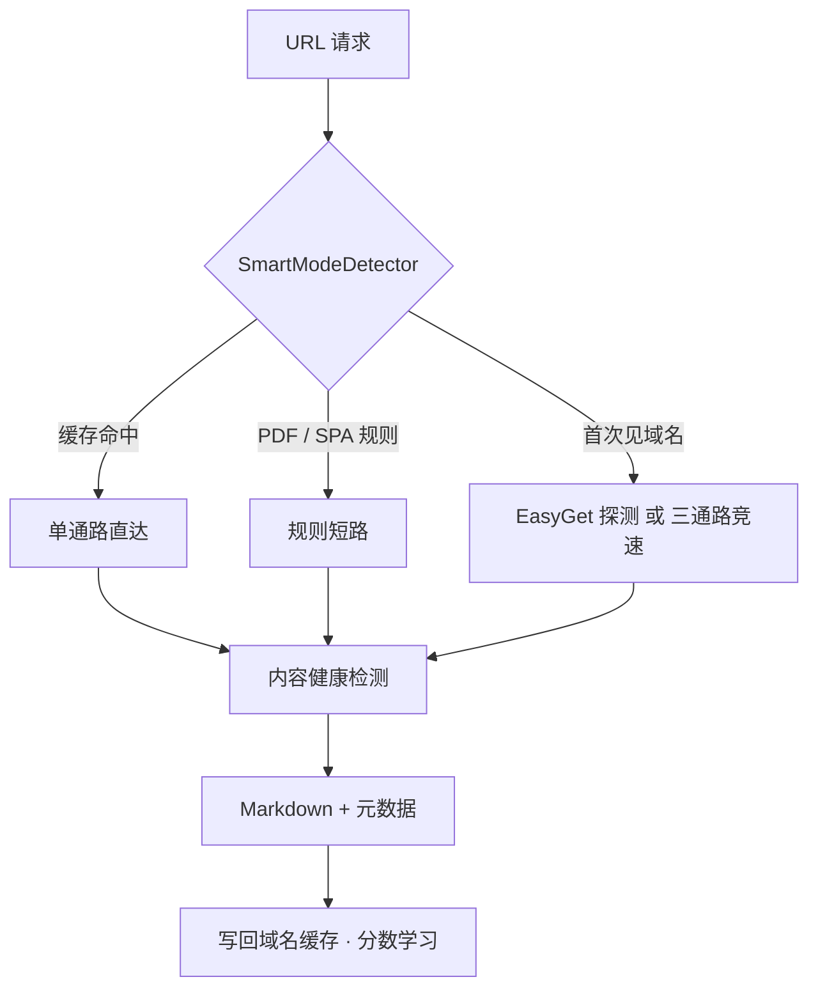
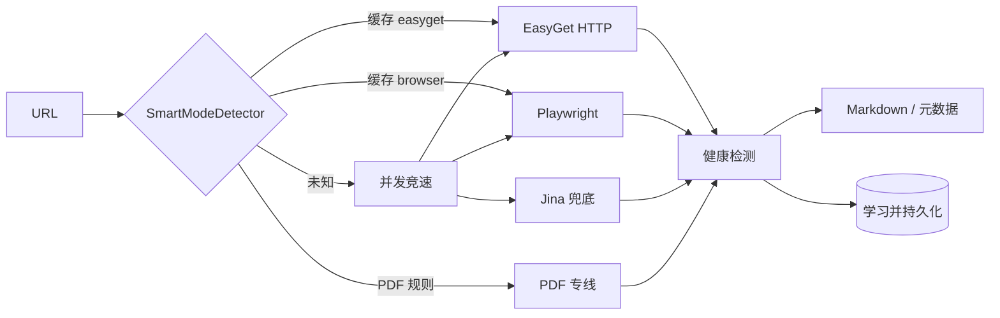

<div align="center">


# OmniFetcher

### AI Agent Network Base

**面向 Agent 与 RAG 的自适应 URL 抓取引擎 —— 自动学习每个域名该走 HTTP、浏览器还是 PDF 专线。**

<br />

[](https://www.python.org/)
[](LICENSE)
[](https://fastapi.tiangolo.com/)
[](https://playwright.dev/)
[](https://github.com/lijiandao/omnifetcher/pulls)

[English](README.md) · [中文](README.zh-CN.md)

<br />

[核心亮点](#-核心亮点) · [性能对比](#-性能对比) · [快速开始](#-快速开始) · [架构](#-架构) · [API](#-api-参考) · [配置与网络](#-配置与网络)

</div>

---

## ✨ 核心亮点

OmniFetcher 不是「又一个 curl + Readability」。它把 **决策、执行、质检、网络、学习** 做成一条闭环：第一次抓某个域名可能慢，但系统会记住「这个站该走哪条路」，并且只把 **通过健康检测** 的正文交给 Agent。



---

### 🧠 1. 自学习路由（SmartModeDetector）

**问题**：掘金用 HTTP 435 ms 就够；知乎必须开浏览器；arXiv PDF 要走专线。写死规则表永远追不上站点变化。

**做法**：规则冷启动 + 真实探测 + 持久化学习。

<details open>
<summary><b>决策优先级（从高到低）</b></summary>

| 顺序 | 条件 | 走哪条路 |
|:--|:--|:--|
| 1 | `domain_cache` 命中 | 直接用缓存的 `easyget` / `playwright` / `jina` / `pdf` |
| 2 | URL 匹配 PDF 规则（`.pdf`、`/pdf/`、已学习域名等） | PDF 专线 |
| 3 | 域名在 SPA 黑名单 | Playwright |
| 4 | 以上皆否 | 发一次真实 EasyGet（10 s 超时）探测正文是否可用 |
| 5 | 探测仍不确定 | 进入 **EasyGet ∥ Playwright ∥ Jina** 三通路并发竞速 |

缓存支持 **父域回退**：`foo.bar.example.com` 未命中 → 查 `bar.example.com` → 查 `example.com`。

</details>

<details>
<summary><b>域名分数机制（不是简单 true/false）</b></summary>

每个域名在 `config/smart_detector_config.json` 里维护 `decision` + `score`：

- 某通路抓取 **成功** → 对应决策 **+1**
- 抓取 **失败** → **-1**
- 决策类型切换 → 分数 **重置为 1**
- 分数 **≤ 0** → 整条缓存 **淘汰**（错误决策不会永久污染）

并发竞速结束后，`learn_from_result()` 还会对比「预测通路 vs 实际赢家」，让缓存逐步收敛到真实最优路径。

</details>

<details>
<summary><b>PDF 模式自动发现</b></summary>

某域名 PDF 抓取成功达到阈值（默认 **3 次**）后：

1. 自动加入 `known_pdf_domains`
2. 从 URL path 提取含 `pdf` 的路径段，写入 `pdf_path_patterns`
3. 配置落盘，**重启不丢**

效果：arXiv 等学术站点 **第一次** 可能还要探测，**第三次起** 几乎零决策成本。

</details>

<details>
<summary><b>SPA 页面 HTML 指纹（冷启动保险）</b></summary>

除域名黑名单外，还对 HTML 做加权打分：

| 判据 | 权重 |
|:--|--:|
| 正文字符过少（空壳 body） | 40 |
| `<script>` 标签 ≥ 10 | 35 |
| React / Vue / Angular 脚本指纹 | 30 |
| `#root` / `app-root` 等 SPA 根容器 | 25 |
| SPA 相关 meta 标签过多 | 10 |

命中 **≥ 2** 项即判 SPA → 直接 Playwright。这是知乎等站点在「还没被学习过」时的兜底。

</details>

---

### ⚡ 2. 多通路竞速（EasyGet ∥ Playwright ∥ Jina）

**问题**：智能检测猜错时，不能让用户在单条死路上白等。

**做法**：三条通路同时起跑，**谁先通过健康检测谁赢**；赢家确定后 **优雅取消** 其余通路（CDP `Page.stopLoading` → `page.close()` → cancel asyncio task）。

| 通路 | 擅长 | 典型场景 |
|:--|:--|:--|
| **EasyGet** | 纯 HTTP、`selectolax` 快解析、可读 Edge Cookie | 掘金、静态博客、直连 PDF |
| **Playwright** | 真浏览器、JS 渲染、学术 PDF 查看器 | 知乎、Cloudflare、需要 Cookie 的站 |
| **Jina** | 第三方 Reader（`r.jina.ai`） | 难站兜底（可选，依赖外网） |

<details>
<summary><b>竞速不是「谁先返回谁赢」</b></summary>

EasyGet / Jina 返回后必须先过 `evaluate_content_health()`：

- 乱码 / 二进制魔数 → **不宣告成功**，继续等 Playwright
- Cloudflare / 验证码短文 → **不宣告成功**
- 正文 < `text_limit`（默认 150 字）→ **不宣告成功**

只有 `verified_http_success` 门闩置位，才会取消浏览器任务。避免「HTTP 拿到拦截页却误判成功、Playwright 被白白 cancel」。

Playwright 先赢时同理：立刻 cancel EasyGet + Jina。

</details>

<details>
<summary><b><code>mode</code> 参数说明</b></summary>

| `mode` | 行为 |
|:--|:--|
| `normal` | **默认推荐**。先查智能缓存；未命中则 EasyGet 探测或三通路竞速 |
| `fast` | 仅 EasyGet，最省资源 |
| `playwright` | 仅浏览器 |
| `jina` | 仅 Jina |
| `no_jina` | EasyGet ∥ Playwright（不依赖 Jina 外网） |

配合 `use_intellicache: true`（默认）= **能学则学，学不会再竞速**。

</details>

---

### 🛡️ 3. 内容质量守卫

**问题**：抓取引擎最危险的失败不是报错，而是 **`success=true` 但内容是验证码 / 空壳 / 乱码** —— 会直接污染 RAG 和 Agent 上下文。

<details open>
<summary><b>三层漏斗</b></summary>

**① 传输解码（EasyGet）**

编码检测链：`Content-Type charset` → HTML `<meta charset>` → `chardet`（置信度 > 0.7）→ `utf-8 / gbk / gb18030 / big5` 等 fallback。

乱码 / 二进制双检测：

- **魔数**：`%PDF-`、`PK\x03\x04`（ZIP）、JPEG 等 → EasyGet 主动失败，交给 Playwright / PDF
- **ftfy `is_mojibake`**：经典 UTF-8 误读乱码
- **可打印字符比例 < 90%**（文本 ≥ 50 字）→ 判非正常文本

**② 语义健康检测（全通路统一 `evaluate_content_health`）**

1. HTTP 401 / 403 / 429 等状态码
2. 拦截关键词（Cloudflare、captcha、rate limit、中文「人机验证」等）—— **只在短文段 < 500 字时触发**，避免长文误伤
3. 文本为空 → `PAGE_NOT_LOADED`
4. 文本 < `text_limit` → `PAGE_PARTIAL_LOAD`

**③ HTML → Markdown 清洗**

`selectolax` 快速 DOM → 可选 Readability → `html2text`。超大页面走 Readability 分片（见下节）。

这就是为什么 Metaso 掘金 **0.7 s 返回拦截页** 仍可能被判可用，而 OmniFetcher **435 ms 返回的是过质检的正文**。

</details>

---

### 🌐 4. Agent 网络底座

「Network Base」= 在真实网络环境里稳定产出 Agent 可消费内容的 **代理编排 + 出口策略 + 大页处理**。

<details>
<summary><b>Clash 代理轮换（每次抓取前触发）</b></summary>

Playwright / 并发模式在每次 `POST /crawl` 前会 **异步**（不阻塞主流程）调用 `_rotate_proxy_for_request()`：

```
1. 通过 Clash External Controller API（默认 127.0.0.1:19099）读取当前策略组（GLOBAL）
2. 批量测速所有可用节点（gstatic generate_204）
3. select_with_weight 加权选节点：
   score = 0.7 × delay_norm + 0.3 × recency_norm
   - delay_norm：延迟越低分越高
   - recency_norm：越久没用分越高（默认冷却 300 s）
4. PUT /proxies/{selector} 切换到选中节点
5. 写入 config/proxy_state/proxy_usage_*.json（重启后冷却度不丢）
```

实际流量默认走 Clash **mixed-port `127.0.0.1:7899`**（见 `smart_detector_config.json` → `proxy_config`）。

相关环境变量：

| 变量 | 默认 | 说明 |
|:--|:--|:--|
| `PROXY_WEIGHT_DELAY` | `0.7` | 延迟在评分中的权重（其余给冷却度） |
| `PROXY_RECENCY_COOLDOWN_SEC` | `300` | 节点冷却窗口（秒） |
| `PROXY_SELECTION_TOPK` | `1` | 从前 K 名高分节点中随机挑一个（>1 增加分散性） |
| `PLAYWRIGHT_PROXY_SERVER` | — | 覆盖 Playwright 代理地址（如 `http://127.0.0.1:7899`） |
| `DISABLE_PROXY_AUTO_RENEW` | `false` | 设为 `true` 关闭后台定时换节点 |
| `PROXY_AUTO_RENEW_INTERVAL` | — | 后台自动换节点间隔（秒） |

> 需要本机已运行 Clash，且 External Controller 端口与策略组名与代码默认一致（API `19099`，selector `GLOBAL`）。若你的 Clash 配置不同，可通过 `GOOGLE_SEARCH_CLASH_CFG` 指向自定义 `conf.ini`（见 [配置与网络](#-配置与网络)）。

</details>

<details>
<summary><b>双跳代理（可选，适合 Google / Jina 等敏感出口）</b></summary>

对地域敏感的上游，可启动本地 **双跳中继**（`python -m omnifetcher.proxy.double_hop_proxy`）：

```
你的程序 → 127.0.0.1:22002 或 22003
         → Clash 7897（第一跳，本地 mixed-port）
         → 711Proxy:10000（第二跳，带账号认证）
         → 目标网站
```

| 本地端口 | 711 账号池 | 典型用途 |
|:--|:--|:--|
| **22002** | HK 轮换（`region-HK`） | Jina Reader、延迟更低的 HK 出口 |
| **22003** | 全球混播（无 region） | Google 搜索、Google Scholar 等易风控页面 |

**启动前**设置环境变量（凭证不进仓库）：

```bash
export DOUBLE_HOP_USER_HK="your-711-user-zone-custom-region-HK"
export DOUBLE_HOP_USER_GLOBAL="your-711-user-zone-custom"
export DOUBLE_HOP_PASS="your-711-password"

python -m omnifetcher.proxy.double_hop_proxy
# 另开终端再启动 OmniFetcher
```

**验证**：

```bash
curl -x http://127.0.0.1:22002 https://ipinfo.io/json
curl -x http://127.0.0.1:22003 https://ipinfo.io/json
```

Jina 通路默认走 `http://127.0.0.1:22002`；Playwright / EasyGet 默认走 `7899`。可按业务需要分别配置。

</details>

<details>
<summary><b>超大 HTML 分片（Readability Map-Reduce）</b></summary>

当 HTML **≥ `chunked_threshold_mb`（默认 8 MB）** 时：

1. 正则去除 base64 图片（避免 10 MB 页面里 8 MB 是 `data:image`）
2. 按 ~512 KB 安全切分（对齐 `</p>` / `</div>` / 空行，块间 overlap 防截断）
3. 每块 Readability → `html2text`
4. map-reduce 合并成完整 Markdown

相关 API 参数：`chunked_threshold_mb`、`chunk_target_kb`、`chunk_overlap_chars`、`chunk_concurrency`。

</details>

---

## 📊 性能对比

> 维护者测试环境实测（2025–2026）。完整截图图集：**[📷 Benchmark Gallery (EN)](docs/BENCHMARKS.md)** · **[📷 性能对比图集 (中文)](docs/BENCHMARKS.zh-CN.md)**


| 场景 | 链接类型 | **OmniFetcher** | Tavily | Exa | Metaso / Reader API |
|:--|:--|--:|--:|--:|--:|
| arXiv 9 页 PDF | 直连 PDF | **791 ms** ✅ | ~3 s（缓存估计） | ~1.8 s | 2.8 s |
| arXiv ~300 页 PDF | 超大 PDF | **3.24 s** ✅ | 片段 | 4 s 超时 ❌ | 25.5 s 失败 ❌ |
| 知乎问答 | 反爬 SPA | **1.61 s** ✅ | 拒绝访问 ❌ | 4 s 超时 ❌ | 5.5 s 空内容 ❌ |
| 掘金文章 | HTML + MD 清洗 | **435 ms** ✅ | — | 4 s 超时 ❌ | 0.7 s 拦截页 ❌ |

<details open>
<summary><b>📸 arXiv 9 页 PDF — 并排截图</b></summary>
<br />
<table>
<tr>
<td width="33%" align="center"><b>OmniFetcher · 791 ms</b><br/></td>
<td width="33%" align="center"><b>Metaso · 2.8 s</b><br/></td>
<td width="33%" align="center"><b>Exa · ~1.8 s</b><br/></td>
</tr>
</table>
</details>

<details>
<summary><b>📸 arXiv 300 页 PDF — 与竞品对比</b></summary>
<br />
<table>
<tr>
<td width="25%" align="center"><b>OmniFetcher · 3.24 s</b><br/></td>
<td width="25%" align="center"><b>Metaso · 失败</b><br/></td>
<td width="25%" align="center"><b>Exa · 超时</b><br/></td>
<td width="25%" align="center"><b>Tavily · 片段</b><br/></td>
</tr>
</table>
</details>

<details>
<summary><b>📸 知乎反爬页面</b></summary>
<br />
<table>
<tr>
<td width="25%" align="center"><b>OmniFetcher · 1.61 s</b><br/></td>
<td width="25%" align="center"><b>Metaso · 5.5 s</b><br/></td>
<td width="25%" align="center"><b>Tavily · 拒绝</b><br/></td>
<td width="25%" align="center"><b>Exa · 超时</b><br/></td>
</tr>
</table>
</details>

<details>
<summary><b>📸 掘金文章（含 Markdown 清洗）</b></summary>
<br />
<table>
<tr>
<td width="33%" align="center"><b>OmniFetcher · 435 ms</b><br/></td>
<td width="33%" align="center"><b>Metaso · 拦截页</b><br/></td>
<td width="33%" align="center"><b>Exa · 超时</b><br/></td>
</tr>
</table>
</details>

**冷启动 → 越用越快**（同域名重复访问）：

| 第几次 | 平均决策耗时 | 说明 |
|--:|--:|:--|
| 第 1 次 | ~10 s | 探测 + 并发竞速 |
| 第 3 次 | ~3 s | 域名分数累积 |
| 第 5 次+ | **~1 s** | 命中最优通路缓存 |

```bash
python benchmarks/run_benchmark.py
python benchmarks/run_benchmark.py --url "https://arxiv.org/pdf/2503.21088"
```

---

## 🚀 快速开始

### 前置要求

- Python **3.10+**
- 可选：本机 [Clash](https://github.com/Dreamacro/clash)（代理轮换 / 7899 出口）
- 可选：711 等上游代理凭证（双跳中继）
- Linux 需执行 `playwright install chromium`；Windows 可配置 Edge 浏览器路径

### 1. 克隆并安装依赖

```bash
git clone https://github.com/lijiandao/omnifetcher.git
cd omnifetcher

python -m venv .venv
source .venv/bin/activate   # Windows: .venv\Scripts\activate

pip install -r requirements.txt
playwright install chromium   # Linux
```

### 2. （可选）注册 CLI 命令

希望直接使用 `omnifetcher` 命令时（等价于 `python -m omnifetcher.start`）：

```bash
pip install -e .
omnifetcher
```

### 3. 启动 HTTP 服务

```bash
python -m omnifetcher.start
# 默认 → http://127.0.0.1:8900
# 健康检查 → GET http://127.0.0.1:8900/health
```

### 4. 抓取示例

```bash
curl -s -X POST http://127.0.0.1:8900/crawl \
  -H 'Content-Type: application/json' \
  -d '{
    "urls": ["https://arxiv.org/abs/2503.21088"],
    "mode": "normal",
    "use_intellicache": true,
    "htmlclean_enabled": true,
    "extract_title": true
  }'
```

或使用示例脚本：

```bash
python examples/fetch_one.py "https://arxiv.org/abs/2503.21088"
```

---

## 🏗 架构




| 模块 | 职责 |
|:--|:--|
| `SmartModeDetector` | SPA/PDF 规则、域名分数缓存、自动学习 |
| `EasyGetCrawler` | 高速 HTTP、编码与乱码检测 |
| `PlaywrightCrawler` | JS 渲染、反爬、独立 Edge 持久化目录 |
| `EasyPDFCrawler` | PDF 直连下载与文本提取 |
| `concurrent_strategies` | EasyGet ∥ Playwright ∥ Jina 竞速 + 优雅取消 |
| `proxy/` | Clash 轮换、加权选节点、双跳中继 |
| `tackle_huge_html` | 超大页面 Readability 分片 |

---

## 📡 API 参考

### `POST /crawl`

批量抓取 URL，返回 Markdown / 元数据。

<details open>
<summary><b>常用请求字段</b></summary>

| 字段 | 类型 | 默认 | 说明 |
|:--|:--|:--|:--|
| `urls` | `string[]` | **必填** | 要抓取的 URL 列表 |
| `mode` | `string` | `normal` | `normal` / `fast` / `playwright` / `jina` / `no_jina` |
| `crawl_type` | `string` | `auto` | `auto` / `pdf` / `web` |
| `use_intellicache` | `bool` | `true` | 是否启用域名智能缓存与学习 |
| `htmlclean_enabled` | `bool` | `true` | 是否清洗 HTML 并输出 Markdown |
| `extract_title` | `bool` | `true` | 是否提取页面标题 |
| `extract_icon` | `bool` | `true` | 是否提取 favicon |
| `timeout` | `int` | `30000` | Playwright 页面超时（毫秒） |
| `easyget_timeout` | `int` | `5` | 并发模式下 EasyGet / Jina 超时（秒） |
| `text_limit` | `int` | `150` | 健康检测最小正文字符数 |
| `concurrent_limit` | `int` | `3` | 批量 URL 时的最大并发数 |
| `use_edge_cookies` | `bool` | `false` | EasyGet 是否读取本机 Edge Cookie |
| `chunked_threshold_mb` | `float` | `8.0` | 触发 Readability 分片的 HTML 大小阈值 |

</details>

<details>
<summary><b>响应结构（简化）</b></summary>

```json
{
  "code": 0,
  "msg": "爬取完成",
  "data": {
    "results": [
      {
        "url": "https://example.com",
        "success": true,
        "markdown": "# 标题\n\n正文…",
        "text_length": 1234,
        "title": "页面标题",
        "actual_crawler": "easyget",
        "execution_time": 0.43
      }
    ]
  }
}
```

失败时 `success: false`，并分字段返回 `easyget_error` / `playwright_error` / `jina_error`，便于 Agent 决定重试策略。

</details>

---

## ⚙️ 配置与网络

### 配置文件

| 路径 | 用途 |
|:--|:--|
| `config/smart_detector_config.json` | SPA/PDF 规则、浏览器参数、**默认代理出口**、已学习域名决策 |
| `config/proxy_state/` | 运行时代理节点使用记录（gitignore，重启后保留冷却度） |
| `conf.ini`（可选，需自行提供） | 自定义 Clash External Controller 端口 / secret / selector |

`smart_detector_config.json` 里与网络相关的默认值：

```json
"proxy_config": {
  "proxy_server": "127.0.0.1:7899",
  "proxy_bypass_list": "localhost,127.0.0.1"
}
```

### 服务与环境变量

| 变量 | 默认 | 说明 |
|:--|:--|:--|
| `OMNIFETCHER_HOST` | `0.0.0.0` | HTTP 监听地址 |
| `OMNIFETCHER_PORT` | `8900` | HTTP 端口 |
| `OMNIFETCHER_BASE` | `http://127.0.0.1:8900` | 示例脚本 / benchmark 使用的服务地址 |
| `OMNIFETCHER_RELOAD` | `false` | 设为 `true` 开启 uvicorn 热重载（开发用） |
| `APP_LOG_LEVEL` | `INFO` | 日志级别 |
| `ENABLE_FILE_LOGGING` | `false` | 设为 `true` 写入日志文件 |
| `APP_LOG_DIR` | `logs` | 日志目录 |

### 代理相关环境变量

| 变量 | 默认 | 说明 |
|:--|:--|:--|
| `GOOGLE_SEARCH_CLASH_CFG` | `conf.ini` | Clash API 配置文件路径 |
| `PROXY_WEIGHT_DELAY` | `0.7` | 选节点时延迟权重 |
| `PROXY_RECENCY_COOLDOWN_SEC` | `300` | 节点冷却窗口（秒） |
| `PROXY_SELECTION_TOPK` | `1` | 从前 K 名节点中随机选择 |
| `PLAYWRIGHT_PROXY_SERVER` | — | 覆盖 Playwright 代理（如 `http://127.0.0.1:7899`） |
| `DISABLE_PROXY_AUTO_RENEW` | `false` | 关闭后台定时换节点 |
| `PROXY_AUTO_RENEW_ENABLED` | `true` | 是否启用后台定时换节点 |
| `PROXY_AUTO_RENEW_INTERVAL` | — | 后台换节点间隔（秒） |

### 双跳代理环境变量

| 变量 | 说明 |
|:--|:--|
| `DOUBLE_HOP_USER_HK` | 711 HK 轮换池用户名（对应本地 **22002**） |
| `DOUBLE_HOP_USER_GLOBAL` | 711 全球混播用户名（对应本地 **22003**） |
| `DOUBLE_HOP_PASS` | 711 密码（两池共用） |

### Jina 相关

| 变量 | 默认 | 说明 |
|:--|:--|:--|
| `http_proxy` / `https_proxy` | `http://127.0.0.1:22002` | Jina 请求出口（需先启动双跳中继） |
| `JINA_MAX_CONCURRENT` | `50` | Jina 最大并发 |

<details>
<summary><b>推荐部署拓扑（含代理）</b></summary>

```
┌─────────────────────────────────────────────────────────┐
│  OmniFetcher  :8900                                      │
│    ├─ EasyGet / Playwright  → Clash :7899（常规出口）    │
│    ├─ Clash API 轮换        → :19099 / selector GLOBAL   │
│    └─ Jina 兜底             → :22002 双跳（可选）        │
└─────────────────────────────────────────────────────────┘
         │                              │
         ▼                              ▼
   Clash mixed-port :7899        double_hop :22002/:22003
         │                              │
         └──────────┬───────────────────┘
                    ▼
              目标网站 / 711 上游
```

最小可运行：只启动 OmniFetcher + Clash（7899 + 19099），不启双跳也能抓大部分站。

</details>

<details>
<summary><b><code>smart_detector_config.json</code> 可编辑项速查</b></summary>

| 区块 | 作用 |
|:--|:--|
| `spa_domains` | 已知 SPA 域名黑名单（直接走 Playwright） |
| `pdf_detection` | PDF 域名 / 路径模式 / 学习阈值 |
| `domains` | 运行时学习写入的域名决策缓存 |
| `detection_thresholds` | SPA HTML 指纹阈值 |
| `browser_config` | Playwright 启动参数 |
| `proxy_config` | Playwright 默认代理出口 |

学习结果会自动写回此文件（按 `auto_save_interval` 定期落盘）。

</details>

---

## 🤝 参与贡献

欢迎 Issue 与 PR。报告抓取失败时请附上 **可复现 URL** 和 `mode` / `use_intellicache` 参数。

更细的代码级说明见 [docs/深挖核心亮点.md](docs/深挖核心亮点.md)。

---

## 📄 许可证

[Apache License 2.0](LICENSE)

---

## ⚠️ 合规说明

请自行遵守目标网站的 ToS 与 robots 策略，合理控制频率，尊重版权。

<div align="center">
<sub>为需要「读网页」的 Agent 而生 —— 更快、更干净、越用越聪明。</sub>
</div>
