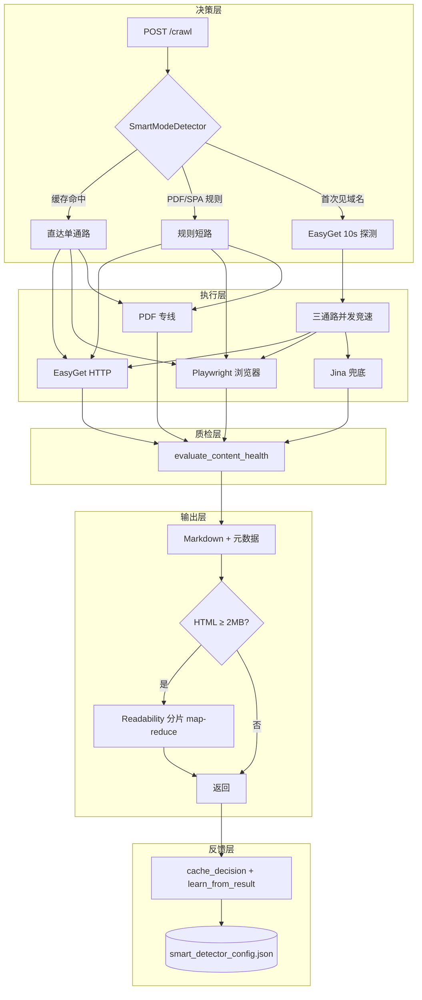

# OmniFetcher 核心亮点深度解析

> 本文对 README 里四条 Highlights 做代码级拆解，适合想理解「它为什么这么快、为什么不返回垃圾内容」的读者。

---

## 一张图看清整体流程

每次 `POST /crawl` 进来，请求会依次经过五层处理：

```
决策层 → 执行层 → 质检层 → 输出层 → 反馈层
```



Benchmark 里「第 1 次 ~10 s、第 5 次 ~1 s」的差异，就来自 **决策层缓存 + 反馈层学习**，不是 HTTP 本身变快了。

---

## 亮点一：🧠 自学习路由（SmartModeDetector）

### 解决的问题

同一个域名，有的用 HTTP 就够（掘金 435 ms），有的必须开浏览器（知乎 SPA），有的是 PDF 专线（arXiv 791 ms）。写死规则表跟不上站点变化；OmniFetcher 的做法是：

**规则冷启动 → 运行时探测 → 持久化学习**

### 决策优先级（从高到低）

| 顺序 | 触发条件 | 结果 |
|:--|:--|:--|
| 1 | `domain_cache` 缓存命中 | 直接走对应通路 |
| 2 | `is_pdf_url(url)` 匹配 | PDF 专线 |
| 3 | `is_spa_domain(url)` 匹配 | Playwright |
| 4 | 以上皆否 | 发一次真实 EasyGet（10 s 超时）探测 |
| 5 | 探测仍不确定 | 进入三通路并发竞速 |

### 三层「记忆」机制

**① 域名决策缓存（`_update_score`）**

```python
# 每个域名只存一个分数，不是简单布尔
if success:
    _update_score(domain, actual_mode, +1)  # 奖励
else:
    _update_score(domain, actual_mode, -1)  # 惩罚

# 分数 ≤ 0 时，整条缓存被淘汰
if entry['score'] <= 0:
    domain_cache.pop(domain_key)
```

这不是 LRU，而是**带置信度的可纠错缓存**——错误决策会被自动淘汰，而不是一错到底。

缓存支持**父域回退**：`foo.bar.example.com` 未命中 → 查 `bar.example.com` → 查 `example.com`，覆盖子域名和 CDN 节点。

**② 并发结束后的闭环学习（`learn_from_result`）**

并发竞速选出最终赢家后，把「预测通路 vs 实际赢家」的差距反馈回分数系统。如果每次 Playwright 都比 EasyGet 先通过健康检测，域名会逐步收敛到 `playwright`，后续跳过探测直接出浏览器。

**③ PDF 模式自动发现（`learn_pdf_pattern`）**

```python
# 某域名 PDF 成功次数达到阈值（默认 3 次）
if domain_stats['success_count'] >= self.pdf_auto_learn_threshold:
    self.pdf_domains.add(domain)            # 加入 PDF 已知域名
    # 同时从 URL path 里提取 /pdf/ 等路径模式
    self.pdf_path_patterns.append(pattern)
```

首次访问可能还要探测，第三次起几乎零决策成本——自动「认识」学术站点。

### SPA 检测：HTML 指纹打分

域名黑名单以外，还有针对 HTML 内容的打分机制：

| 判据 | 权重 |
|:--|--:|
| 正文字符 < 阈值（body 空壳） | 40 |
| `<script>` 标签 ≥ 10 个 | 35 |
| React / Vue / Angular 脚本指纹 | 30 |
| `#root` / `app-root` 等 SPA 根容器 | 25 |
| SPA 相关 meta 标签 ≥ 3 个 | 10 |

命中 **≥ min_criteria_match** 项即判 SPA → 直接走 Playwright。这是知乎、掘金部分情况下冷启动时的保险丝。

### 和 Benchmark 的对应

| 场景 | 路由如何命中 |
|:--|:--|
| arXiv PDF | `is_pdf_url` 规则 → PDF 专线，不走通用 HTML |
| 掘金 | 首次 EasyGet 探测成功 → 缓存 `easyget` → 后续 435 ms |
| 知乎 | SPA 域名 / EasyGet 探测失败 → `playwright` → 1.61 s |

---

## 亮点二：⚡ 多通路竞速（EasyGet ∥ Playwright ∥ Jina）

### 解决的问题

智能检测猜错、或第一次见域名时，单通路失败意味着用户白等。并发策略的本质：**用算力换确定性，用最早通过健康检测的结果换延迟**。

### 三条通路各自擅长什么

| 通路 | 优势 | 劣势 |
|:--|:--|:--|
| **EasyGet** | 纯 HTTP、可复用 Edge Cookie、`selectolax` 快解析 | JS 渲染页、强反爬 |
| **Playwright** | 真浏览器、Edge 持久化 Profile、学术 PDF 查看器 | 启动/渲染成本高 |
| **Jina** | 第三方 Reader，部分难站「外包阅读」 | 依赖外网、作兜底 |

### 竞速不是「谁先返回谁赢」

这是最容易误解的地方。流程如下：

```
EasyGet 返回
    ↓ 先过 evaluate_content_health
    ↓ 乱码/二进制/Cloudflare 页 → 不宣告成功
    ↓ 通过 → easyget_success_flag.set()
            → asyncio.create_task(_close_page_gracefully())
            → Page.stopLoading + page.close() + 取消 Playwright task
```

核心保护是 `verified_http_success` 门闩：只有经过质检的 HTTP 结果，才能触发「取消浏览器」。避免「EasyGet 拿到 Cloudflare 验证码页面，误判成功，Playwright 白费了」。

Playwright 先赢的反向逻辑同理：浏览器成功 → 立刻 cancel EasyGet + Jina。

### 请求模式矩阵

| `mode` 参数 | 行为 |
|:--|:--|
| `fast` | 仅 EasyGet，最省资源 |
| `playwright` | 仅浏览器 |
| `jina` | 仅 Jina |
| `no_jina` | EasyGet ∥ Playwright（去掉外网依赖） |
| `normal` + `use_intellicache=true` | 先查缓存，未命中再三通路并发（**默认推荐**） |
| `normal` + `use_intellicache=false` | 直接三通路并发 |

---

## 亮点三：🛡️ 内容质量守卫

### 解决的问题

抓取引擎最危险的失败不是「报错」，而是**「success=true 但内容是验证码/空壳 SPA/乱码」**——这会直接污染 RAG 索引和 Agent 上下文。OmniFetcher 设有多层漏斗。

### 第一层：传输解码（EasyGet 内部）

**编码检测链**（`detect_encoding`）：

1. `Content-Type` 响应头 `charset`
2. HTML `<meta charset>`
3. `chardet`（置信度 > 0.7）
4. 常见中文编码 fallback：`utf-8 → gbk → gb2312 → gb18030 → big5 → latin1`

中文站点常见的 GBK/GB18030 页面不会出现「一堆问号」。

**乱码 / 二进制双检测**（`should_fail_easyget`）：

```python
def should_fail_easyget(raw: bytes, plain_text: str) -> bool:
    is_binary = is_binary_magic(raw[:8])   # 魔数：%PDF- / JPEG / ZIP ...
    probably_binary = is_probably_binary(plain_text)  # ASCII 可打印比 < 90%
    return is_binary or probably_binary
```

命中即 EasyGet 主动失败，把任务交给 Playwright 或 PDF 专线，而不是把乱码返回出去。

### 第二层：语义健康检测（全通路统一）

`evaluate_content_health(text, status_code)` 判定顺序：

1. **HTTP 状态码**：401 / 403 / 429 等 → 对应 reason
2. **拦截关键词**（Cloudflare、captcha、rate limit、中文「人机验证」等）  
   **关键细节**：只在**文本 < 500 字**的短文段才触发，长正文里出现 security 不会误伤
3. **文本为空** → `PAGE_NOT_LOADED`
4. **文本 < 100 字** → `PAGE_PARTIAL_LOAD`

这就是 Metaso 0.7 s 返回掘金拦截页仍被判失败的原因——它的内容通不过第 2 关。

### 第三层：HTML → Markdown 清洗

EasyGet 用 `selectolax`（基于 Modest C 库）做快速 DOM 解析；可选 Readability 提取正文；最终 `html2text` 转 Markdown。超大页面走亮点四的分片机制。

---

## 亮点四：🌐 Agent 网络底座

「Network Base」不只是「能发 HTTP」，而是在真实网络环境下稳定产出 Agent 可消费内容的一整套基础设施。

### 4.1 代理轮换：`select_with_weight`

每次 `normal` 模式抓取前，会异步调一次 `_rotate_proxy_for_request`（不阻塞主流程）：

```python
# 评分 = delay_norm * weight_delay + recency_norm * (1 - weight_delay)
# delay_norm：延迟越低越接近 1
# recency_norm：越久没用越接近 1（避免打穿热点节点）
score = delay_norm * w + recency_norm * (1 - w)
```

使用历史写入 `config/proxy_state/proxy_usage_*.json`，重启后冷却度数据不丢失。

### 4.2 双跳中继（可选）

`double_hop_proxy.py` 在本地起 `22002/22003` 端口，流量路径是：

```
本地请求 → 22002/22003 → Clash → 上游 711 池
```

适用于地域敏感的请求（Google Scholar、部分 DOI 解析等）。凭证走环境变量，不进仓库。

### 4.3 登录态与反爬

Playwright 可挂载 Edge User Data Dir（持久化登录态）；EasyGet 可读 Edge SQLite Cookie 数据库（`EdgeCookieReader`）。支持 Windows / Linux / macOS 三平台路径自动检测。

对需要账号态的站点，这是 EasyGet 快路径能成立的前提。

### 4.4 超大 HTML 分片（`tackle_huge_html`）

触发条件：HTML **≥ 2 MB**（可配置）。

流水线：

1. **去 base64 图片**（预编译正则，防止 10 MB 页面里 8 MB 是 `data:image`）
2. **切块**：按 `</p>` / `</div>` / 空行对齐，每块 ~512 KB，块间 overlap 防截断
3. **每块 Readability → `html2text`**
4. **map-reduce 合并** 成完整 Markdown

让「单页巨型文档 / 全站导出 HTML」不会 OOM，也不会把整个 DOM 塞进 LLM 上下文。

---

## 四条亮点如何配合

| 若缺少... | 会发生什么 |
|:--|:--|
| 只有竞速，无学习 | 每个 URL 都烧三条通路，成本 3x |
| 只有学习，无竞速 | 第一次见域名猜错就整体失败 |
| 只有竞速，无质检 | 「成功但不可用」的内容污染 RAG |
| 只有抓取，无网络底座 | 反爬站、地域限制、超大页面全线崩溃 |

四条组合在一起，才是 **「AI Agent Network Base」** 的完整含义：不是又一个 curl wrapper，而是带记忆、带竞速、带质检、带网络编排的 URL 认知层。

---

## 四个 Benchmark 场景复盘

### arXiv 9 页 PDF · 791 ms

```
is_pdf_url → PDF 专线 → 魔数 %PDF- 校验 → PyMuPDF 抽文本 → Markdown
（不走 SPA 探测，不启动三通路竞速）
```

### arXiv ~300 页 · 3.24 s

```
PDF 专线 + 本地 PyMuPDF 处理超大文件
竞品 Reader API：远程解析 + 固定超时 → 25.5 s 失败 / 4 s 超时
本地专线：直连 + 本地解析，延迟随页数线性，不受远程队列影响
```

### 知乎 · 1.61 s

```
SPA 域名 / EasyGet 探测失败
→ Playwright + 代理轮换 + Edge 上下文
→ evaluate_content_health 确认非空壳
→ Readability 出 Markdown
竞品：单通路 HTTP / 远程 Reader → 空内容 / 超时
```

### 掘金 · 435 ms

```
首次：EasyGet 探测成功 → 写入 domain_cache（easyget, score=1）
后续：缓存命中 → 单通路 HTTP
→ 编码检测 + 健康检测 + htmlclean → 435 ms
竞品 Metaso：HTTP 也快（0.7 s），但返回的是拦截页 HTML，未过质检
```

---

## 想了解更多

- [README 中文版](../README.zh-CN.md)
- [性能对比截图图集](BENCHMARKS.zh-CN.md)
- 代码入口：`omnifetcher/playwright_service/playwright_router_helper.py`（SmartModeDetector）、`omnifetcher/utils/concurrent_strategies.py`（竞速逻辑）
